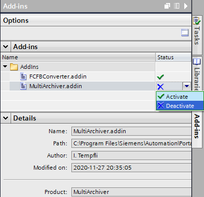
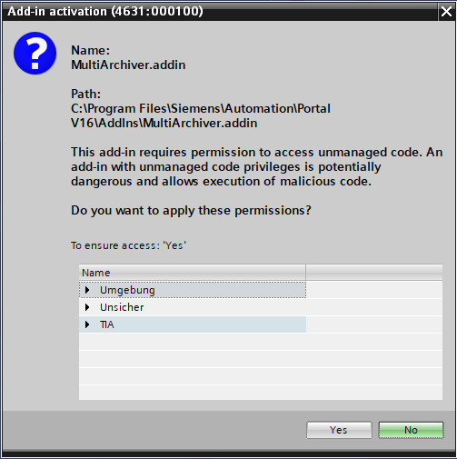
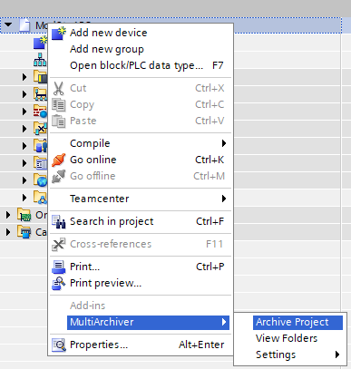
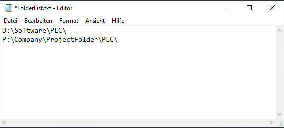

# MultiArchiver
TIA Portal Add-In for archiving project to multiple folders
# Installation

Please copy the .addin-file into the "AddIns" folder of your TIA Portal installation path.
Per default, it is C:\Program Files\Siemens\Automation\Portal V16\AddIns\

To activate add-ins, follow these steps:

1. Open the "Add-ins" task card.
2. In the "Add-ins" pane, navigate to the add-in that you want to activate.
3. In the shortcut menu of the add-in or in the "State" column, select the command "Activate".

4. The add-in ask for permission. Select 'Yes'

More info about Add-ins:
https://support.industry.siemens.com/cs/ww/en/view/109773506/128474251915

# Features
## Archive Project 

Arcives the current project to the saved paths.

### View Folders
Display in a dialog the target folders with comment "Ok" or "Not found"

# Settings
* **Edit Folders** - Opens, using the operating systems default _*.txt_ editor (e.g. Edit) the _FolderList.txt_ file.
Simply copy and paste the required paths into this file, save and close normally.

The file is saved into the project files, thus each TIA Project will have its own archive target list.

* **Move old files to the Archive folder** - Automatically moves the old archive files into an "Archive" folder in all target paths.
* **Show not found folders when completed** - Displays a dialog at the end, listing the not reacheable folders.
* **Debug** - Activates verbose logging

The log files can be found under the following path:
**%appdata%/TIA Add-Ins/MultiArchiver/&lt;Add-In Version&gt;/Logs**
